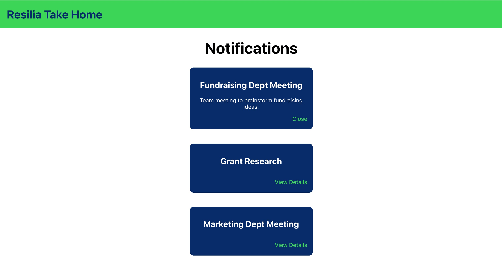

# Resilia Take Home



## Description

This fullstack application is Waverley Leung's solution to Resilia's take home exercise.

The Rails API has one model (Notification) with two attributes: title and details. There is currently only one `get` route to `/notifications`, which returns all of the notifications that are seeded within `db/seeds.rb`. 

The React frontend fetches the notifications with the `useEffect` hook, where it is then stored through state within `App.js` and passed down as props to `NotificationsContainer`.

## Tech Stack

- Frontend: React/CSS
- Backend: Ruby on Rails
- Database: PostgreSQL

## Getting Started

### Dependencies

#### Frontend

- Node Package Manager (`npm`)
- Node.js

Follow the [instructions here to install Node.js and `npm`](https://nodejs.org/en/). Note that `npm` is distributed with Node.js which means that when you download Node.js, you automatically get `npm` installed on your computer.

#### Backend

- Ruby on Rails
- PostgreSQL

Follow the [instructions here to install Ruby](https://www.ruby-lang.org/en/documentation/installation/). You can also try `ruby -v` to check if you have Ruby already installed on your computer. If using macOS you can simply install Ruby with Homebrew by running in your terminal:

```
brew install Ruby
```

Once you have Ruby installed you will need to install [Rails](https://guides.rubyonrails.org/v5.0/getting_started.html#installing-rails). To do so you can use the `gem install` command provided by RubyGems, and afterwards to verify everything is installed correctly, you should be able to run: `rails --version`:

```
gem install rails
```

Follow the [instructions here to install PostgreSQL](https://www.postgresql.org/download/). If using macOS you can simply install PostgreSQL with Homebrew by running in your terminal:

```
brew install postgresql
```

### Installing and Executing

- Clone down this repo locally with the following command in your terminal:

```
git clone <this-repo>
```

- Open up two tabs in your terminal
- For each tab, `cd` into the directory
- Have one tab `cd backend` and the other `cd frontend`
- In the `backend`, bundle install to get all required dependencies

```
bundle install
```

- In the `backend`, set up the PostgreSQL database

```
rails db:create
```

- In the `backend`, create migrations and add the seed data

```
rails db:migrate
rails db:seed
```

- Launch the Rails server!

```
rails s
```

- In the `frontend`, install all required dependencies

```
npm install
```

- In the `frontend`, launch the React server!

```
npm start
```

**Note**: For convenience, it's important to start the backend (Rails) server first. By doing so, Rails will be available at `localhost:3000` and then the frontend (React) will change to a different port after prompting you in the terminal (simply type `y` once the prompt appears). You will then be able to view the frontend at `localhost:3001`.

## Solution Formulation
I chose my tech stack because I am most familiar and comfortable with it. 

That said, what I like most about Rails is how easy it is to create seed data and see the schema and migrations. Since there is only one model (Notification) and therefore no relations, I decided to not include [Serializers](https://github.com/rails-api/active_model_serializers) and found no reason to add anything within the model. On the other hand, since the requirements specified for the notifications to be sent from the API, I only have one `get` route that, through the `NotificationsController`, sends all the notifications with the `index` method when a request is made.

I chose React as my frontend to take advantage of React's state, props, and hooks. I decided to use the `useEffect` hook so that on page load/refresh the notifications will be fetched and displayed because I believe it is better user experience; I do not think that the user would necessarily want to see a blank page first and then need to do an "extra step" by clicking on something to get the notifications. Once the notifications are received as a response from the API, I turn that response into JSON and then update the state of `notifications`. I decided to also separate the `NotificationsContainer` and `Notification` into their own components to separate concerns, make it easier to debug, and make them reusable for the future. As a result, since I separated these components I needed to pass the notifications to display as props.
